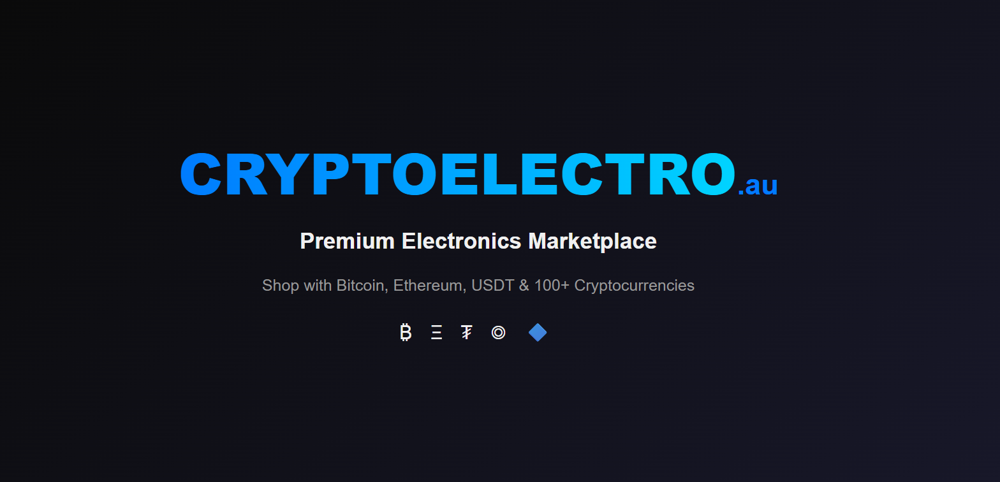

# Cryptoelectro-au 🛒



**[cryptoelectro.au](https://cryptoelectro.au)** — Australia's premium electronics marketplace with cryptocurrency payments. Shop smartphones, laptops, cameras, gaming consoles, and home appliances with Bitcoin, Ethereum, USDT, TRX, and 100+ cryptocurrencies.

---

## 🚀 Features

### For Customers
- 🛍️ **Premium Electronics** — Smartphones, cameras, computers, gaming consoles, home appliances
- 💰 **Crypto Payments** — Pay with BTC, ETH, USDT, TRX, SOL, and 100+ cryptocurrencies via NowPayments
- 🚀 **Fast Shipping** — Australia-wide & surrounding regions (free over $500)
- 🎁 **Loyalty Rewards** — Earn points on every purchase (Bronze → Silver → Gold → Platinum → Diamond)
- 🔒 **Secure** — JWT authentication, bcrypt encryption, XSS/CSRF protection

### For Affiliates
- 🤝 **5% Commission** — Earn crypto on every referral purchase
- 🔗 **30-Day Cookie** — Get credited even if they buy later
- 💎 **Real-Time Dashboard** — Track clicks, conversions, and earnings
- 💸 **Instant Withdrawals** — Convert to store credit or withdraw to TRX wallet

### For Admins
- 📊 **Real-Time Dashboard** — Revenue, orders, products, customers
- 📦 **Product Management** — Full CRUD with images, specs, colors
- 🛒 **Order Management** — Update status, track payments
- 👥 **Customer Management** — View, block/unblock users
- ⭐ **Review Moderation** — Approve or delete reviews
- 📝 **Blog & Careers** — Full CRUD from admin panel
- 🔍 **Audit Logs** — Track all security events

---

## 🛠️ Tech Stack

| Layer | Technology |
|-------|-----------|
| **Frontend** | Next.js 16, TypeScript, Tailwind CSS, Framer Motion |
| **Backend** | Next.js API Routes (REST) |
| **Database** | PostgreSQL (Neon Serverless) |
| **ORM** | Prisma 6 |
| **Auth** | JWT (jose) with HTTP-only cookies, bcrypt (12 rounds) |
| **Payments** | NowPayments API + IPN Webhook |
| **Email** | Nodemailer + Gmail SMTP |
| **Validation** | Zod schemas |
| **Security** | CSP, XSS Protection, Rate Limiting, Audit Logs |
| **SEO** | Schema JSON-LD, Sitemap, Robots.txt, OG Tags, Breadcrumbs |
| **Deployment** | Vercel (Frontend) + Neon (Database) |

---

## 🚀 Getting Started

### Prerequisites
- Node.js 24+
- PostgreSQL database (Neon recommended)
- NowPayments account
- Gmail account (for email sending)

### Installation

```bash
git clone https://github.com/josuekelly-droid/cryptoelectro-au.git
cd cryptoelectro-au
npm install